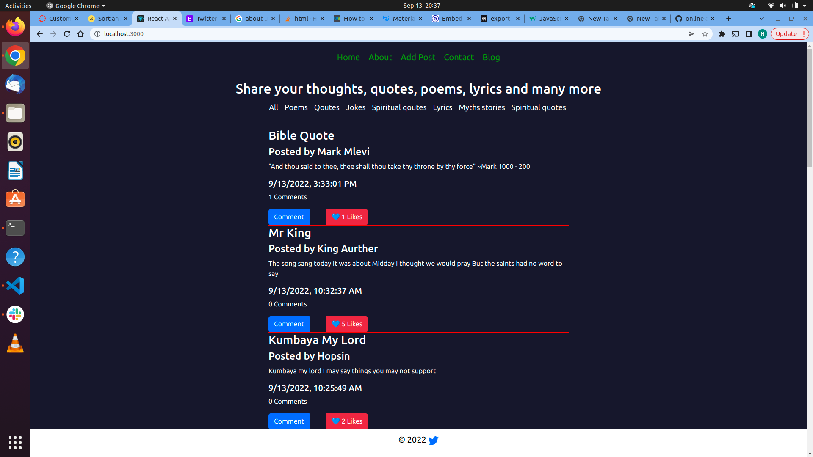
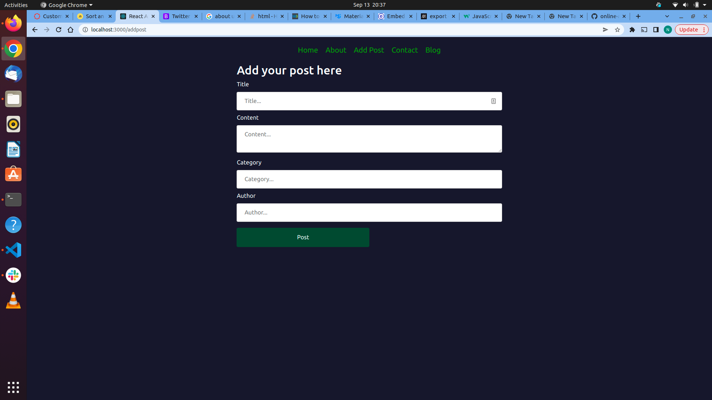
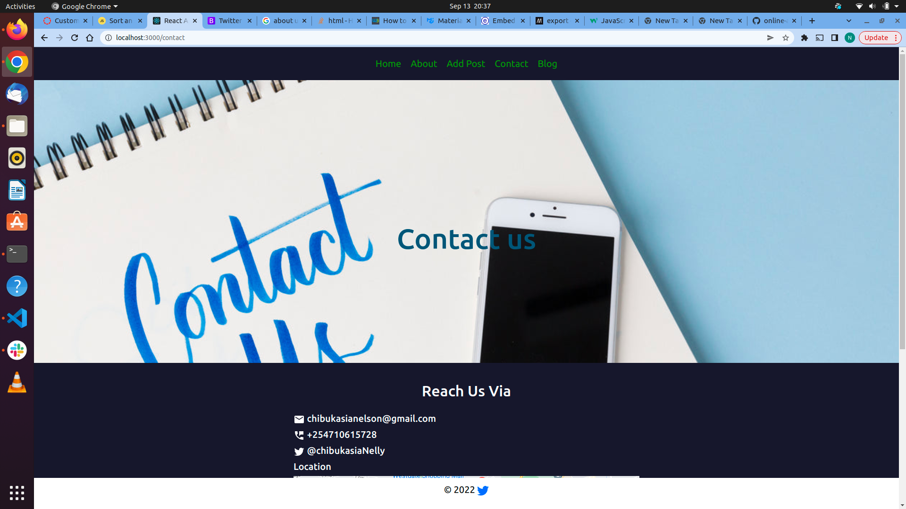
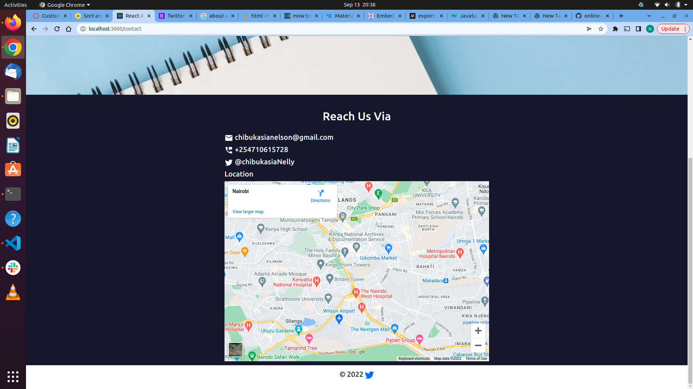

# Free Posts
## Description
Free posts is a web based application that allows users to add and views posts created by other users. 
A user can add a post, comment and like a post. The posts have different variations ranging from articles, poems, jokes, stories, quotes, to spiritual quotes. 
## Running the application 
The project uses an API created from a backend server on this link.....

To run this application on your computer, you will have to first clone and run the backend provided in the link above. Then clone this repository into your computer and run the follwing commands: 

### prequisites 
To run the project, you will need the following installed on your computer 
- node js 
- npm 
### Configurations 
Run `npm install` to intall all the packeges and dependencies 
Run `npm start` to start the server on localhost 

### Sample screenshots from the project 
#### The Home page 

#### Add post 

#### Contact us 

